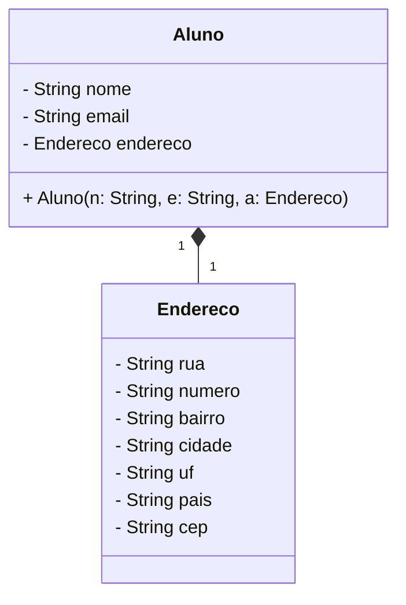

```mermaid
    classDiagram
        class Aluno{
            - String nome
            - String email
            - Endereco endereco
            + Aluno(n: String, e: String, a: Endereco)
        }
        
        class Endereco{
            - String rua
            - String numero
            - String bairro
            - String cidade
            - String uf
            - String pais
            - String cep
        }
        
        Aluno "1"*--"1" Endereco
```
