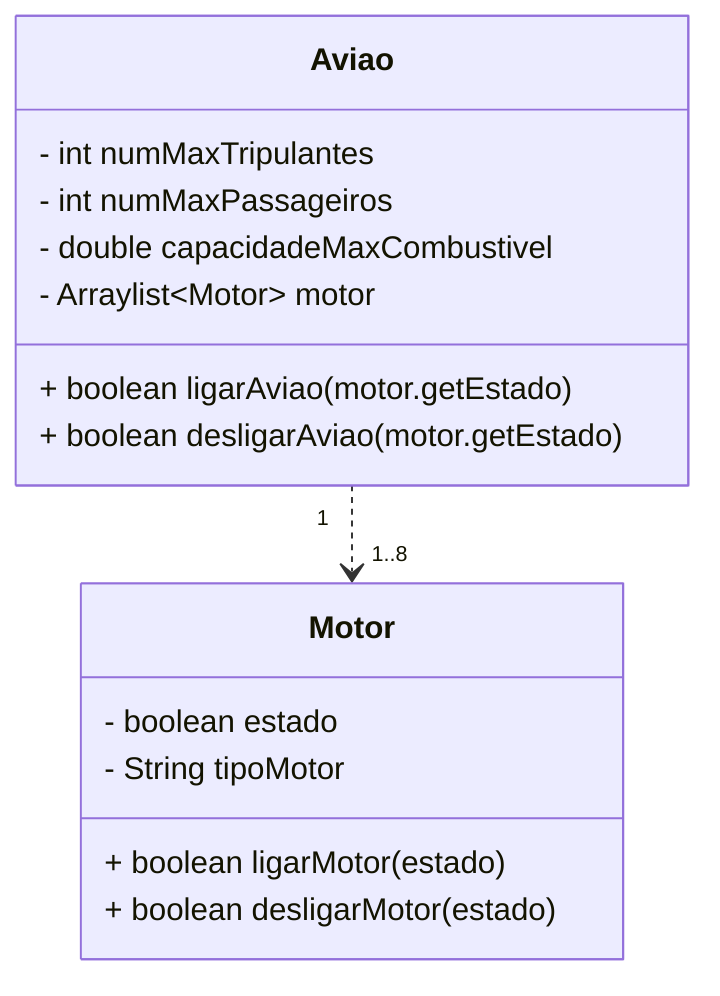

```mermaid
    classDiagram
        class Aviao{
            - int numMaxTripulantes
            - int numMaxPassageiros
            - double capacidadeMaxCombustivel
            - Arraylist~Motor~ motor
            + boolean ligarAviao(motor.getEstado)
            + boolean desligarAviao(motor.getEstado)
        }
        
        class Motor{
            - boolean estado
            - String tipoMotor
            + boolean ligarMotor(estado)
            + boolean desligarMotor(estado)
        }
        Aviao "1"..>"1..8" Motor
```