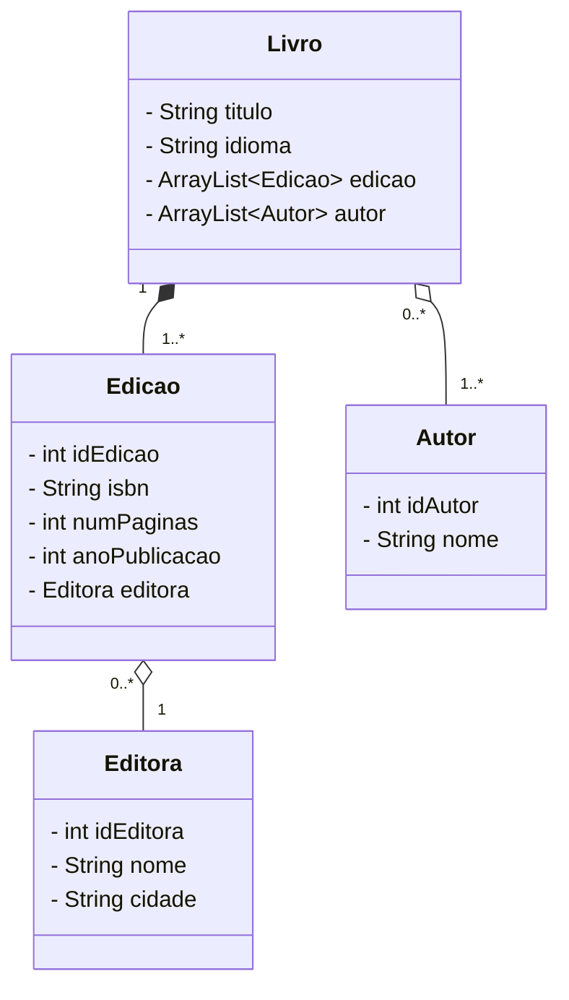
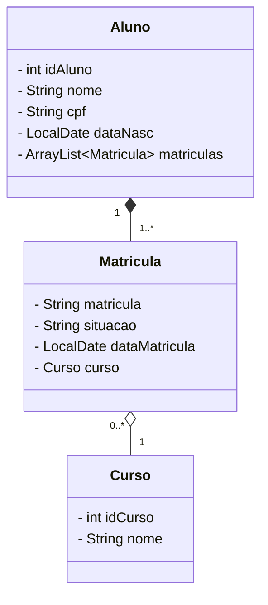

```mermaid
classDiagram
    class Livro{
        - String titulo
        - String idioma
        - ArrayList~Edicao~ edicao
        - ArrayList~Autor~ autor
    }
    
    class Edicao{
        - int idEdicao
        - String isbn
        - int numPaginas
        - int anoPublicacao
        - Editora editora
    }
    
    class Editora{
        - int idEditora
        - String nome
        - String cidade
    }
    
    class Autor{
        - int idAutor
        - String nome
    }
    
    Livro "1"*--"1..*" Edicao
    Edicao "0..*"o--"1" Editora
    Livro "0..*"o--"1..*" Autor
```

```mermaid
classDiagram
    class Aluno{
        - int idAluno
        - String nome
        - String cpf
        - LocalDate dataNasc
        - ArrayList~Matricula~ matriculas
    }
        
    class Matricula{
        - String matricula
        - String situacao
        - LocalDate dataMatricula
        - Curso curso
    }
    
    class Curso{
        - int idCurso
        - String nome
    }
    
    Aluno "1"*--"1..*" Matricula
    Matricula "0..*"o--"1" Curso
```