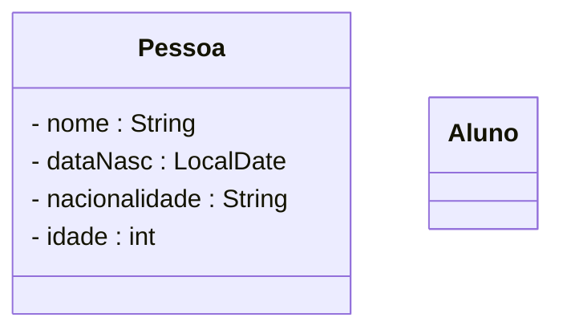

```mermaid
classDiagram
    class Pessoa{
        - nome : String
        - dataNasc : LocalDate
        - nacionalidade : String
        - idade : int        
    }
    
    class Aluno{
        
    }
```