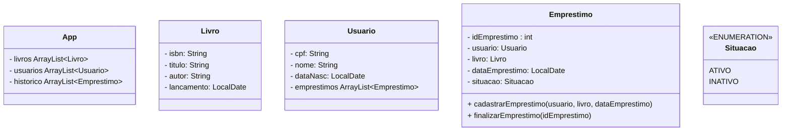

# Diagrama de Classes UML

```mermaid
classDiagram

    class App{
        - livros ArrayList~Livro~ 
        - usuarios ArrayList~Usuario~
        - historico ArrayList~Emprestimo~
    }
    class Livro{
        - isbn: String
        - titulo: String
        - autor: String
        - lancamento: LocalDate
    }
    
    class Usuario{
        - cpf: String
        - nome: String
        - dataNasc: LocalDate
        - emprestimos ArrayList~Emprestimo~
    }
    
    class Emprestimo{
        - idEmprestimo : int
        - usuario: Usuario
        - livro: Livro
        - dataEmprestimo: LocalDate
        - situacao: Situacao
        
        + cadastrarEmprestimo(usuario, livro, dataEmprestimo)
        + finalizarEmprestimo(idEmprestimo)
    }
    
    class Situacao{
        <<ENUMERATION>>
        ATIVO
        INATIVO
    }
    
    
```